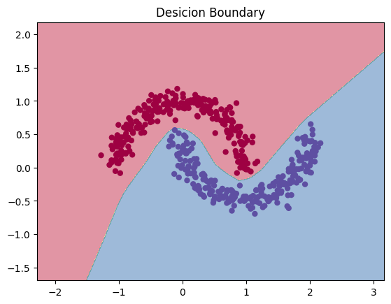

## Overview

Mini Torch is a lightweight library built on top of PyTorch, aimed at providing an accessible and educational platform for learning the fundamentals of deep learning and neural networks. It simplifies complex concepts and enables users to experiment with basic architectures and training processes.

## Features

- **Educational Focus**: Designed for learners and educators to understand key concepts in deep learning.
- **Simple API**: A user-friendly interface for creating and training neural networks.
- **Modular Components**: Easily customizable components that allow for quick experimentation.

## Demo

An example of a result obtained using the Mini Torch library:

